# Repository of the paper BI vs FI revisited

## Litterature review

To see the litterature review, go on https://rob174.github.io/BibliographyMaker/.

1. Load the [litterature_review_papers.json](data/litterature_review_papers.json) file with the button load data.
2. Click on the Graph menu at the top left of the window
3. Click on "add structure": load the file [structure_categorization.json](data/structure_categorization.json)
4. Then click on the "View Graph" tab

## Algorithms

### TSP

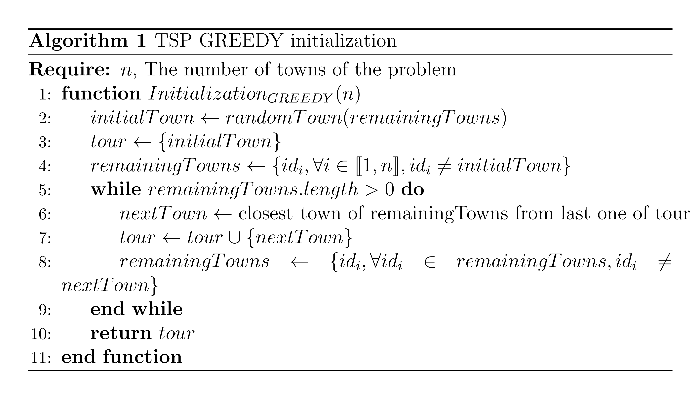
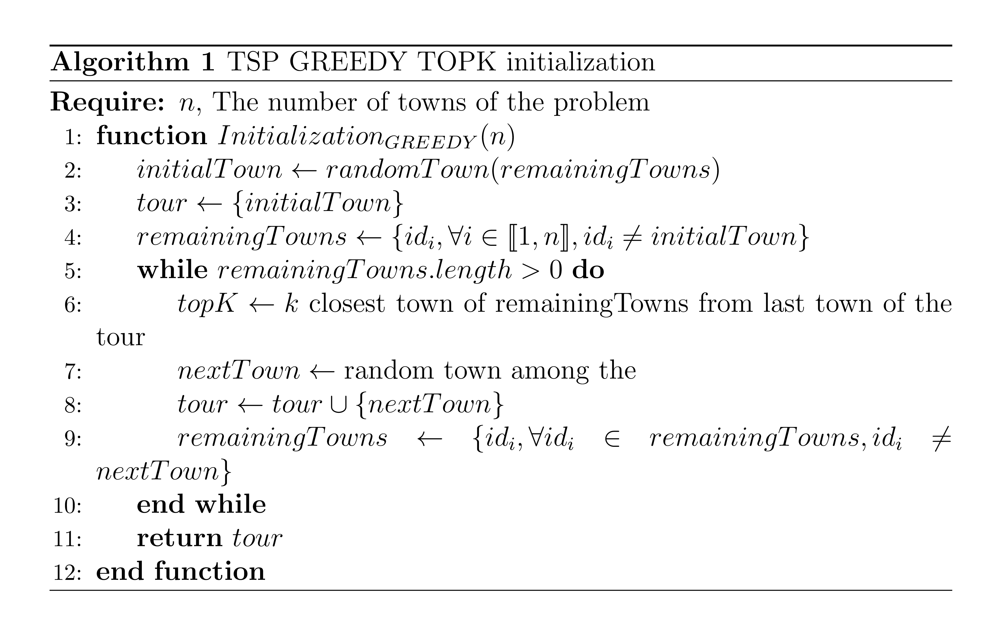
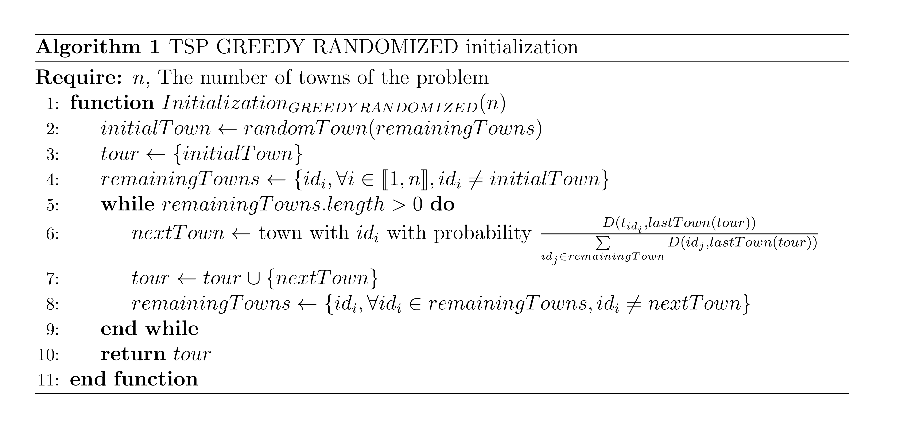
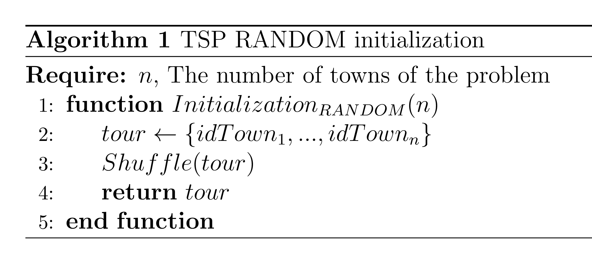

### MSSC

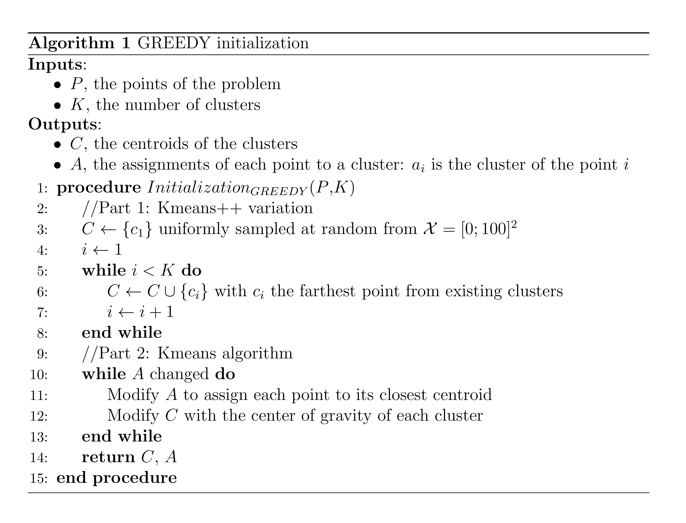
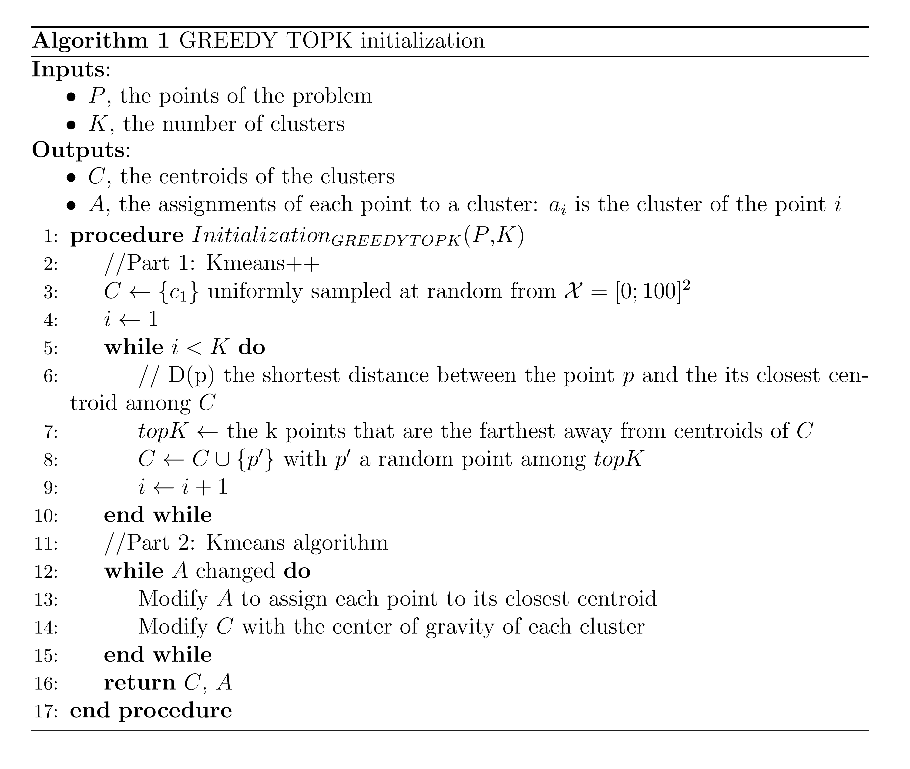
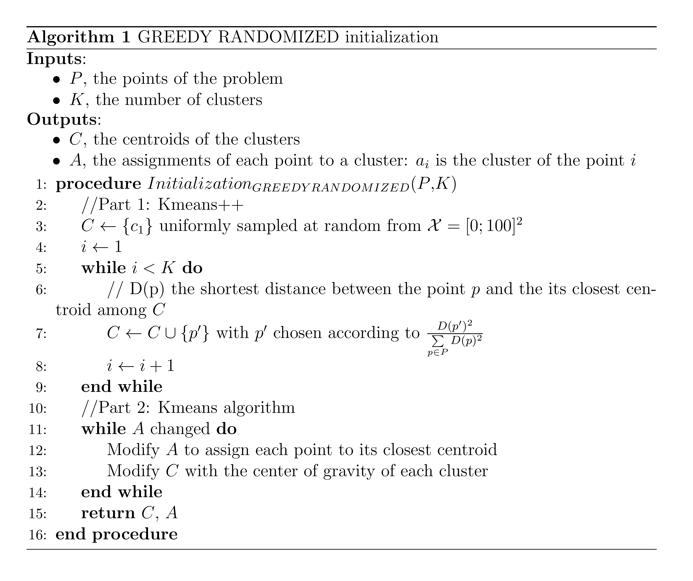
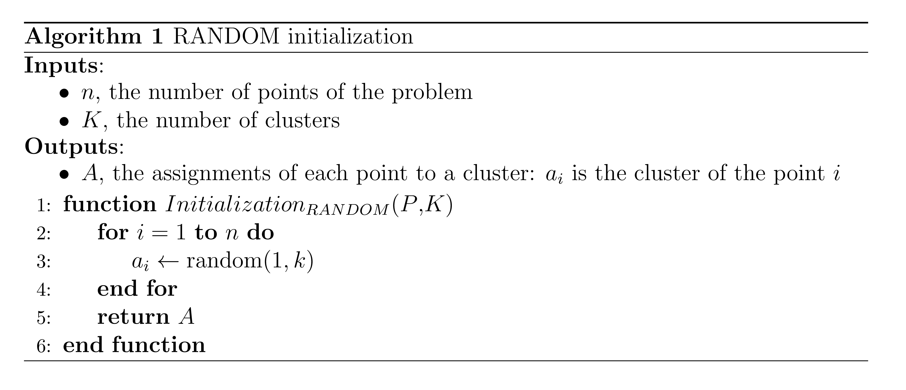

### wMAXSAT

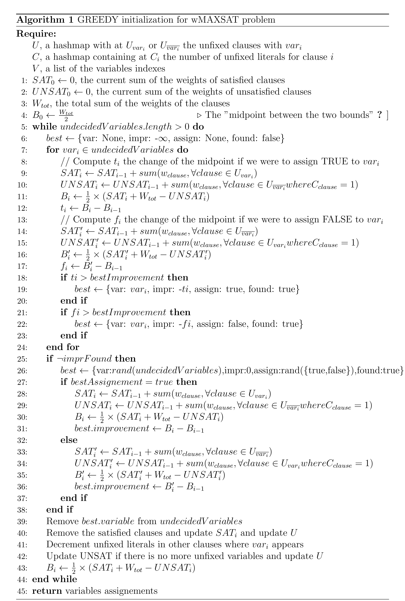
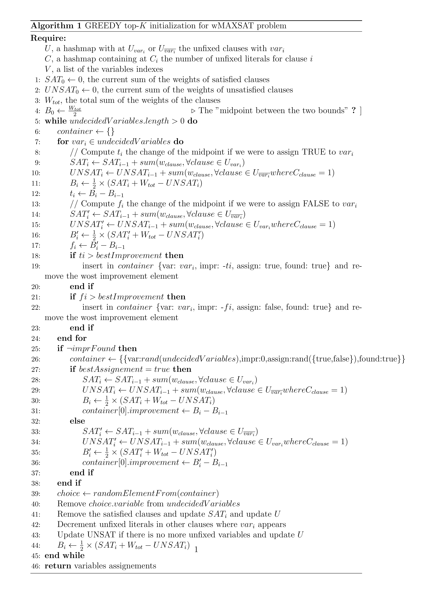
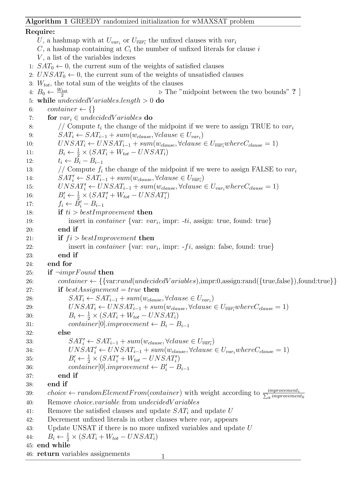
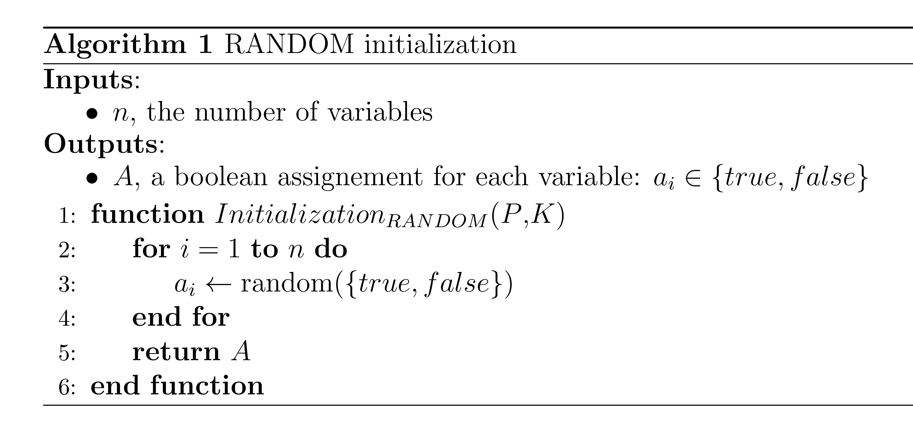
